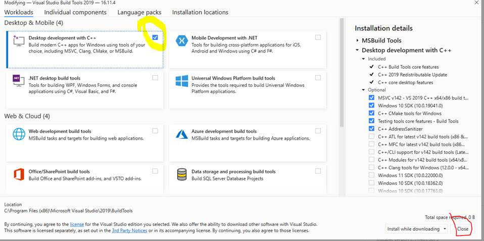
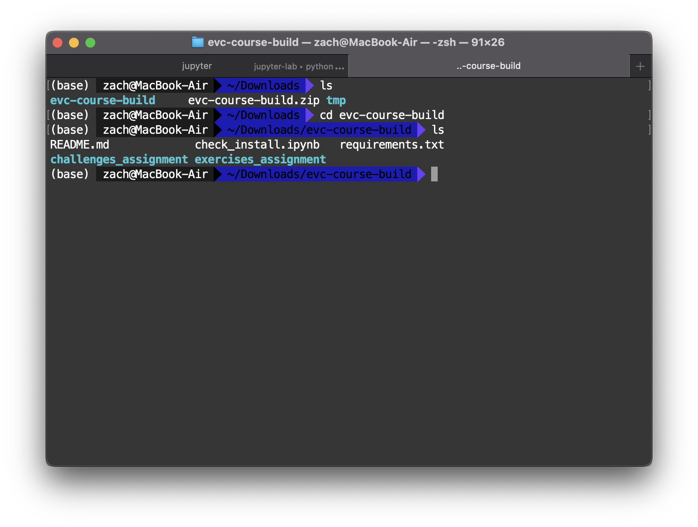
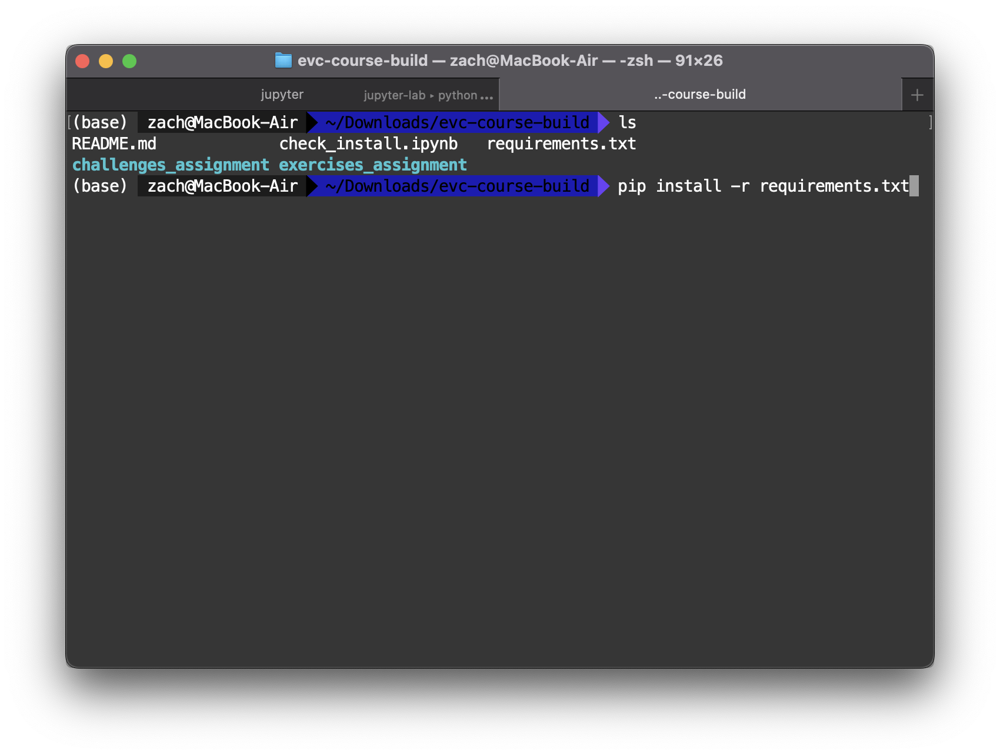
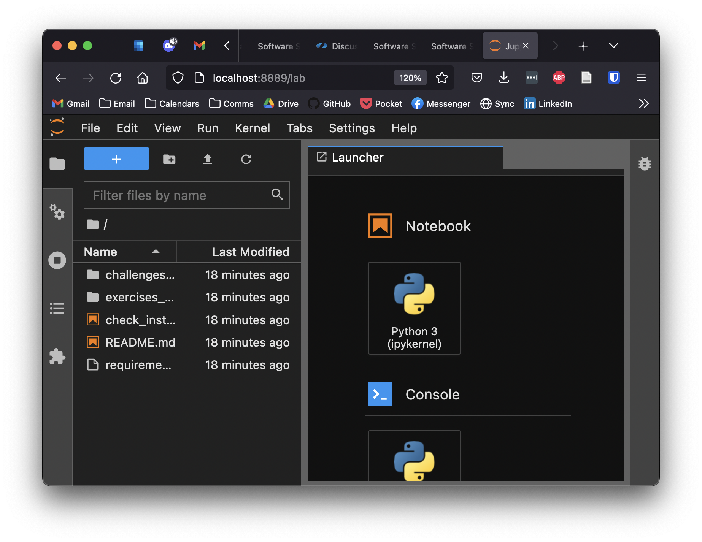
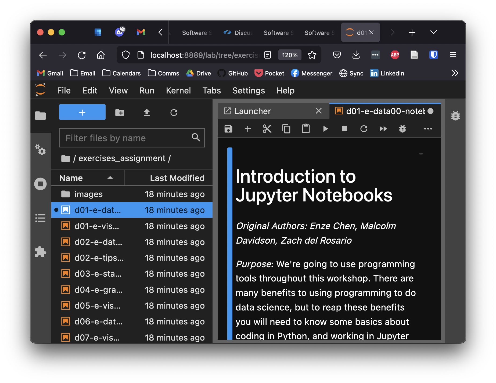

(setup)=
# Software Setup

In short, you'll need:

- Exercise files (Download)
- Python and Jupyter (Recommended: Anaconda)

**If you have any issues with these steps**: Please ask a TA! We will gladly
help you set up your environment.

# Exercises Files
<!-- ------------------------- -->

We will work through a number of programming exercises in this course. We have
consolidated the exercise notebooks and installation files in a single zip;
download the following and unzip.

- [Course materials](https://github.com/zdelrosario/evc-course/archive/refs/heads/build.zip)

This will download a file called `evc-course-build.zip`. Save this to a stable location on your computer; for instance, your Documents folder.

# Python and Jupyter Installation
<!-- ------------------------- -->

We recommend [Anaconda
python](https://www.anaconda.com/distribution/#download-section), which will
provide *almost* everything you need. Make sure to install python version `>=
3.0`.

## Windows Installation
<!-- ------------------------- -->

If you are on Windows, you may need to install [Visual C++ Build Tools](https://visualstudio.microsoft.com/downloads/#build-tools-for-visual-studio-2019). You will need to download the file under `Tools for Visual Studio 2019 > Build Tools for Visual Studio 2019`: This [Stack Overflow post](https://stackoverflow.com/questions/40504552/how-to-install-visual-c-build-tools) gives more details; note that Microsoft continually "updates" these links. If the build tools link above does not work for you, try Googling `"microsoft visual c++ build tools"`: This is (honestly!) the best way to find a working link.

```{admonition} Make sure to select the build tools
When installing Visual C++, you may see the following interface. If yes, do not click launch; instead, first click `Modify`.


Within this menu, make sure the C++ build tools are selected, as pictured below.



Once you've selected these tools, you can click `Install`.
```

# Tutorial: Using a Terminal
<!-- -------------------------------------------------- -->

Many software tools are most easily accessed through a programmatic interface called a *terminal*. This section is a brief tutorial on using a terminal. We will make minimal use of the terminal in this course, but it will be absolutely essential for setting up your computer for the course. Please ask a TA if you have any issues using a terminal.

## Opening a terminal

- Mac: `terminal.app` is your terminal -- you can find this through Spotlight
  search (Command + Spacebar).
- Windows: **After** you have installed Anaconda python, you will have access to
  `Anaconda prompt` -- use this as your terminal for the course.
- Linux: If you're on Linux, you probably already use a terminal regularly. On
  Ubuntu the shortcut to open a terminal is `Ctrl + Alt + T`.

After opening your terminal, you should see a window that looks something like the following.


To use the terminal, you manually type commands, then press Enter to execute.

## Changing directory

When looking for files (Mac: Finder, Windows: Explorer, Linux: e.g. Nautilus), we use a program to look at *directories*. Your terminal does something similar---at any point it is *located* in a particular *directory*. The following screenshot illustrates `c`hanging `d`irectories (`cd`) to my `Downloads` folder, then `l`i`s`ting (`ls`) the contents of said directory. This is where I placed the `evc-course-build.zip` archive for the course. (Note: On Windows, you must use the command `dir`, rather than `ls`.)


I unzip the archive `evc-course-build.zip` from within terminal with the command `unzip
evc-course-build.zip`, which results in the following:



*Note*: On Windows, instead of `unzip`, you will need to run `tar -xf
exercises.zip`.

I can then `cd` into the unzipped folder `evc-course-build` and install the required Python packages with `pip install -r requirements.txt`. However, I can only do this after I've installed Anaconda!

# Python Module Installation
<!-- ------------------------- -->

Once you have installed python, you will need to install a handful of python modules to complete all the course exercises. Anaconda provides a package installer called `pip`; from the command line, you can simply execute the following commands.

In your terminal, change directory to where you unzipped the exercises, and execute the command:

```
pip install -r requirements.txt
```

This will install the requirements for the course.



(open-jupyter)=
# Opening Jupyter Notebooks
<!-- ------------------------- -->

Jupyter notebooks are a particular way of working with Python code. They are designated with the file extension `.ipynb`. Unfortunately, you cannot simply double-click on a Jupyter notebook to open it. Instead, you must launch the Jupyter client from your terminal. Navigate to the directory where you want Jupyter to launch (for the course, this is where you unzipped the contents of `evc-course-build.zip`), and execute the command `jupyter lab`.


This will open a webpage in your browser with a file explorer-like view; you can then click on the notebooks in that directory to open them. You can find files using the Folder tab, pictured below.



Go ahead and open `check_install.ipynb`, which you will run at the end of installation to check if everything is set up correctly.

Once you have verified your install, you can access all the Exercises and Challenges from the appropriate folder. For instance, I opened the first exercise in the following image.



# Final Check
<!-- -------------------------------------------------- -->

To check that you've successfully set up your computer for the course, please
run the following jupyter notebook.

```{admonition} Test your installation
Download and run [check_install.ipynb](https://github.com/zdelrosario/evc-course/blob/main/check_install.ipynb). This is also included in the [course materials](https://github.com/zdelrosario/evc-course/archive/refs/heads/build.zip) file noted above.

Navigate to the folder where you downloaded `check_install.ipynb`,
execute the command `jupyter lab`, open `check_install.ipynb`,
and click on `Run > Run all cells`. If you can successfully run the
notebook (without errors), then you are ready for the course!
```

# Progression
<!-- -------------------------------------------------- -->

The `exercises_assignment/` folder contains the take-home exercises that will
introduce you to the concepts and skills covered in the class. Each of these
exercises is labeled with a prefix (e.g. `d01-` for the first day), so the
exercises should appear in your folder in-order. You should try these exercises
on your own, but if you get stuck, keep in mind that the
[solutions](https://zdelrosario.github.io/evc-course/frontmatter/exercises.html)
are available online!

The `challenges_assignment/` folder contains the homeworks for the course. These
are provided without solutions, so try to complete these to the best of your
ability.

**TODO** (Add schedule for exercises and challenges...)
